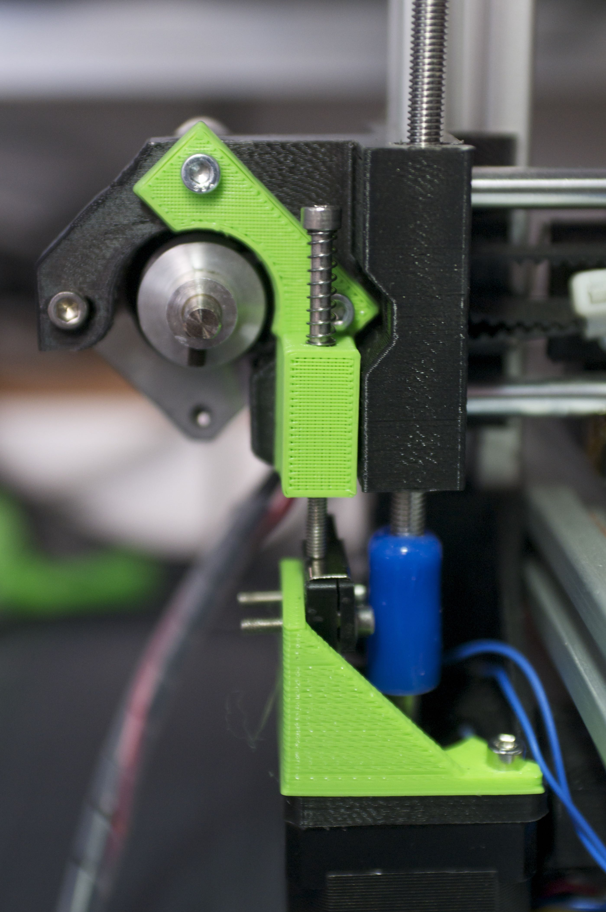

# Adjustable Z-endstop for FoldaRap 1.1

Easily adjustable Z-endstop holder for the FoldaRap 1.1.

Uses a M3 screw, so with a pitch of 0.5mm, a quarter turn allows you to adjust the height by 0.125mm.

## Instruction

The endstop is mounted with M2.5 screws and a M3 nut needs to be inserted in the top piece.
